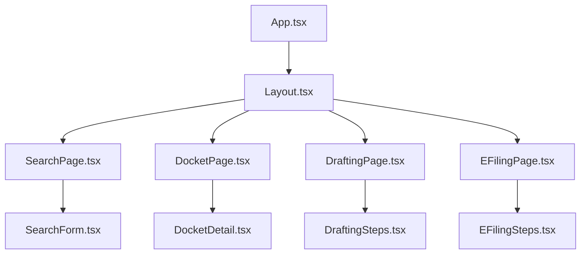
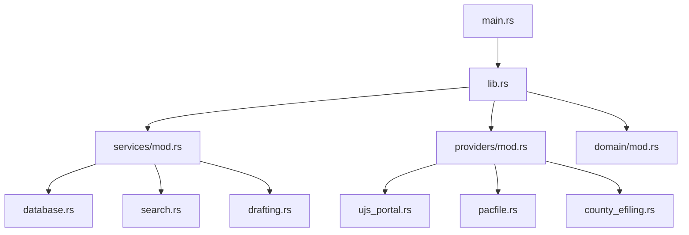

# PA eDocket Desktop - Project Structure

This document provides a comprehensive overview of the project structure and organization.

## Root Directory

```
drafter/
├── .github/                    # GitHub Actions workflows and templates
├── .keys/                      # Signing keys (gitignored)
├── automation/                 # Automation scripts and workflows
├── config/                     # Configuration files
├── dist/                       # Built distribution files
├── docs/                       # Documentation
├── scripts/                    # Build and deployment scripts
├── src/                        # Frontend source code
├── src-tauri/                  # Rust backend source code
├── templates/                  # Document templates
├── CHANGELOG.md                # Version history
├── README.md                   # Project overview
└── package.json                # Node.js dependencies and scripts
```

## Frontend Structure (`src/`)

```
src/
├── components/                 # Reusable React components
│   ├── DocketDetail.tsx       # Docket information display
│   ├── DraftingSteps.tsx      # Document drafting wizard
│   ├── EFilingSteps.tsx       # E-filing workflow
│   ├── Layout.tsx             # Main application layout
│   └── SearchForm.tsx         # Docket search interface
├── lib/                       # Utility libraries
│   ├── citations/             # Citation formatting
│   └── formatting/            # Document formatting
├── pages/                     # Page components
│   ├── DocketPage.tsx         # Docket details page
│   ├── DraftingPage.tsx       # Document drafting page
│   ├── EFilingPage.tsx        # E-filing page
│   ├── SearchPage.tsx         # Search interface page
│   └── SettingsPage.tsx       # Application settings
├── providers/                 # Data providers
├── stores/                    # State management
├── types/                     # TypeScript type definitions
├── utils/                     # Utility functions
├── App.tsx                    # Main application component
├── main.tsx                   # Application entry point
└── index.css                  # Global styles
```

## Backend Structure (`src-tauri/`)

```
src-tauri/
├── benches/                   # Performance benchmarks
│   └── citation_benchmarks.rs
├── migrations/                # Database migrations
│   └── 001_initial.sql
├── src/                       # Rust source code
│   ├── config/                # Configuration management
│   │   ├── mod.rs             # Main config module
│   │   └── security.rs        # Security configuration
│   ├── domain/                # Domain models and types
│   │   └── mod.rs             # Shared domain types
│   ├── providers/             # External service providers
│   │   ├── client.rs          # HTTP client utilities
│   │   ├── county_efiling.rs  # County e-filing systems
│   │   ├── ctrack.rs          # C-Track integration
│   │   ├── mod.rs             # Provider traits and common code
│   │   ├── pacfile.rs         # PACFile e-filing
│   │   └── ujs_portal.rs      # UJS Portal integration
│   ├── services/              # Business logic services
│   │   ├── automation.rs      # Background automation
│   │   ├── citations.rs       # Citation engine
│   │   ├── court_rules.rs     # Court-specific rules
│   │   ├── database.rs        # Database operations
│   │   ├── drafting.rs        # Document drafting
│   │   ├── export.rs          # Export functionality
│   │   ├── mod.rs             # Service module exports
│   │   ├── search.rs          # Search coordination
│   │   ├── security.rs        # Security services
│   │   └── task_runner.rs     # Task execution
│   ├── utils/                 # Utility modules
│   │   ├── mod.rs             # Utility exports
│   │   └── rate_limiter.rs    # Rate limiting
│   ├── lib.rs                 # Library entry point
│   └── main.rs                # Application entry point
├── tests/                     # Integration tests
│   ├── integration_tests.rs   # Main integration tests
│   └── test_config.rs         # Test utilities
├── Cargo.toml                 # Rust dependencies
└── tauri.conf.json            # Tauri configuration
```

## Configuration (`config/`)

```
config/
├── courts.yaml                # Court metadata and formatting rules
├── global.yaml                # Global application settings
├── jobs.yaml                  # Automation job definitions
├── providers.yaml             # Provider configurations
└── security.yaml              # Security policies
```

## Scripts (`scripts/`)

```
scripts/
├── deploy.sh                  # Deployment automation
├── package.sh                 # Build and packaging
├── run_tests.sh               # Test execution
├── setup-signing.sh           # Code signing setup
└── verify-signing.sh          # Signature verification
```

## GitHub Actions (`.github/workflows/`)

```
.github/workflows/
├── ci.yml                     # Continuous integration
└── release.yml                # Release automation
```

## Documentation (`docs/`)

```
docs/
├── api/                       # API documentation
├── architecture.md            # System architecture
├── project-structure.md       # This file
└── user-guide.md              # User documentation
```

## Templates (`templates/`)

```
templates/
├── motion_basic.txt           # Basic motion template
├── motion_discovery.txt       # Discovery motion template
├── motion_summary_judgment.txt # Summary judgment template
└── pleading_answer.txt        # Answer pleading template
```

## Key Files

### Configuration Files

- **`package.json`**: Frontend dependencies, scripts, and metadata
- **`src-tauri/Cargo.toml`**: Rust dependencies and project metadata
- **`src-tauri/tauri.conf.json`**: Tauri application configuration
- **`postcss.config.js`**: PostCSS and Tailwind CSS configuration
- **`tsconfig.json`**: TypeScript compiler configuration
- **`vite.config.ts`**: Vite build tool configuration

### Documentation Files

- **`README.md`**: Project overview and quick start guide
- **`CHANGELOG.md`**: Version history and release notes
- **`LICENSE`**: Software license (MIT)
- **`CONTRIBUTING.md`**: Contribution guidelines
- **`SECURITY.md`**: Security policy and reporting

### Build and Deployment

- **`.gitignore`**: Git ignore patterns
- **`.env.example`**: Environment variable template
- **`Dockerfile`**: Container configuration (if applicable)
- **`docker-compose.yml`**: Multi-container setup (if applicable)

## Module Dependencies

### Frontend Dependencies



### Backend Dependencies



## Data Flow

### Search Flow
1. **Frontend**: User enters search criteria in `SearchForm.tsx`
2. **Backend**: `search.rs` coordinates provider calls
3. **Providers**: `ujs_portal.rs` queries PA court systems
4. **Database**: Results cached in `database.rs`
5. **Frontend**: Results displayed in `SearchPage.tsx`

### Drafting Flow
1. **Frontend**: User selects template in `DraftingPage.tsx`
2. **Backend**: `drafting.rs` processes template with case data
3. **Services**: `citations.rs` formats legal citations
4. **Services**: `court_rules.rs` applies court-specific formatting
5. **Services**: `export.rs` generates final document

### E-Filing Flow
1. **Frontend**: User initiates filing in `EFilingPage.tsx`
2. **Backend**: `providers/pacfile.rs` handles authentication
3. **Services**: `security.rs` manages credentials
4. **Providers**: Document submitted to court system
5. **Database**: Filing status tracked and cached

## Testing Structure

### Frontend Tests
- **Unit Tests**: Component testing with React Testing Library
- **Integration Tests**: Page-level testing with user interactions
- **E2E Tests**: Full application workflows with Playwright

### Backend Tests
- **Unit Tests**: Individual function and module testing
- **Integration Tests**: Service integration and database testing
- **Benchmarks**: Performance testing with Criterion

## Build Process

### Development Build
1. **Frontend**: Vite dev server with hot reload
2. **Backend**: Cargo watch for automatic rebuilds
3. **Integration**: Tauri dev mode connects frontend and backend

### Production Build
1. **Frontend**: Vite builds optimized bundle
2. **Backend**: Cargo builds release binary
3. **Packaging**: Tauri creates platform-specific installers
4. **Signing**: Code signing for security and distribution

## Security Considerations

### Sensitive Files (Gitignored)
- `.keys/` - Signing keys and certificates
- `.env.local` - Local environment variables
- `certificate.*` - Code signing certificates
- `*.p12`, `*.pfx` - Certificate files

### Security Measures
- **Credential Storage**: OS keychain integration
- **HTTPS Enforcement**: All external API calls
- **Content Security Policy**: XSS protection
- **Input Validation**: Comprehensive validation on all inputs
- **Rate Limiting**: API abuse prevention

## Deployment Architecture

### Local Development
- **Frontend**: http://localhost:1420 (Vite dev server)
- **Backend**: Embedded in Tauri application
- **Database**: Local SQLite file

### Production Distribution
- **macOS**: Signed DMG with notarization
- **Windows**: Signed MSI and NSIS installers
- **Linux**: DEB packages and AppImage

### Auto-Updates
- **Update Server**: GitHub Releases
- **Update Manifest**: JSON with version and download URLs
- **Signature Verification**: Ed25519 signatures for security
- **Update UI**: Built-in update notifications and installation

This structure provides a scalable, maintainable, and secure foundation for the PA eDocket Desktop application.
